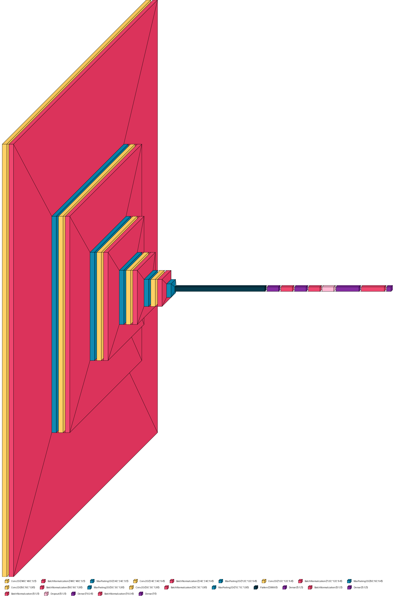

# Brain Tumor Classifier using Convolutional Neural Networks



This project implements a Convolutional Neural Network (CNN) for classifying brain tumors with high accuracy. Using a well-structured CNN model, the classifier achieved **95.51% test accuracy**.

## Dataset

The dataset used for this project is from Kaggle: [Brain Tumor Dataset](https://www.kaggle.com/datasets/preetviradiya/brian-tumor-dataset/data). It consists of labeled images for "Brain Tumor" and "Healthy" categories.

## Model Architecture

The model architecture is visualized in the image above (`model_plot2.png`). It features multiple convolutional, pooling, and dense layers optimized for high accuracy on the dataset.

## Features

- **Accuracy**: Achieved 95.51% accuracy on the test set.
- **Binary Classification**: Classifies images into two categories: "Brain Tumor" or "Healthy".
- **Robust Preprocessing**: Includes data augmentation techniques to improve model generalization.
- **Other Metrics**: All other metrics such as precision, recall, F1-score, and more are calculated and visualized. These can be found in the **Model Evaluation** and **Comparison with Test Set** sections of the `Brain_tumor_Classifier.ipynb` notebook, along with detailed graphs and analyses.

## Usage

1. Clone the repository:
   ```bash
   git clone https://github.com/yourusername/brain-tumor-classifier.git
   cd brain-tumor-classifier
   ```
2. Place the dataset in the data/ directory with the structure:
    ```bash
    Project:
    └───Dataset
        ├───Dataset_nonsplit
        │   ├───Brain Tumor
        │   └───Healthy
    ```